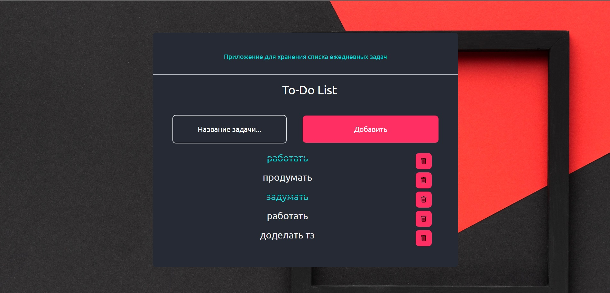

# Инструкция запуска приложения

1) Клонировать репозиторий
2) cd server
3) npm install
4) cd client
5) npm install
6) cd .. (чтобы запустить сервер)
7) node server.js или nodemon server.js
8) cd client
9) npm start
10) проверяете localhost:3000

Все должно запуститься и работать исправно.

P.S. Убедитесь что у ВАС на ПК локально установлены Node.js и MongoDB.

## Задачи: Список задач (To-Do List)

### 1 Функции

Добавление задачи: Пользователь должен иметь возможность добавить новую задачу, указав ее название.

Отметка выполненных задач: Пользователь может отметить задачу как выполненную.

Удаление задачи: Пользователь должен иметь возможность удалить задачу.

Фильтрация задач: Пользователь может выбрать опцию для просмотра всех задач, выполненных задач или невыполненных задач.

### 2 Хранение данных

Данные о задачах должны сохраняться, чтобы пользователь мог видеть их при последующих посещениях.

### 3 Приветственный экран

При открытии приложения пользователь должен видеть приветственный экран с кратким описанием функций приложения.

### 3 Технические требования:
Используйте соответствующий фреймворк для бэкенда (если требуется).
Реализуйте простой дизайн интерфейса.
Используйте локальное хранилище для сохранения данных на стороне клиента (или базу данных на стороне сервера).

### 3 Бонусные задачи (необязательно):

Реализуйте возможность редактирования задачи.
Добавьте возможность установки срока выполнения для задач.
Реализуйте аутентификацию пользователей.
Добавьте красивые анимации и стили для улучшения пользовательского опыта.

### Создано с помощью

- React js
- Node js
- Express
- Axios
- MongoDB
- Mongoose
- Cors
- TailwindCSS

### Скриншоты

  
  

### Полезные ресурсы

- [MDN Web Docs](https://developer.mozilla.org/en-US/) - искал информацию когда застрявал.

### Автор

- Website - [Jalga](https://github.com/coder-96)
